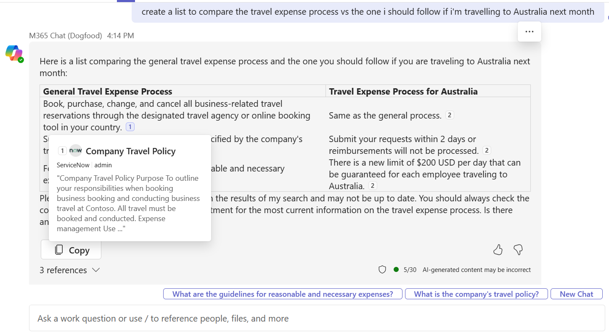

# Microsoft Graph Connectors for Microsoft Copilot for Microsoft 365

Microsoft Graph connectors provide a platform for you to ingest your unstructured, line-of-business data into Microsoft Graph, so that Copilot for Microsoft 365 can reason over the entirety of your enterprise content. Content ingested through Graph connectors is added to the Microsoft Graph; this unlocks semantic understanding of your users' prompts in Copilot for Microsoft 365. However, Graph connectors are not limited to Copilot for Microsoft 365. Graph connector content participates in other Microsoft 365 intelligent experiences like Microsoft Search, Context IQ, and the Microsoft 365 app.

In this article, you will learn how your Graph connector content participates in Copilot for Microsoft 365 and how to configure your custom Graph connections for Copilot for Microsoft 365.

:::image type="content" source="assets/images/copilot_graph-connectors-infographic.png" alt-text="This infographic summarizes how Microsoft Graph connectors make your data available to Microsoft 365 intelligent experiences" lightbox="assets/images/copilot_graph-connectors-infographic.png":::

## Watch the overview

> [!VIDEO https://www.youtube.com/embed/17rAOh9313g]

## How Microsoft Graph connector content surfaces in Copilot for Microsoft 365

By using Microsoft Graph connectors to ingest your external content into Microsoft Graph, your users can use Copilot for Microsoft 365 to find, summarize, and learn from your line-of-business data through natural language prompts.

:::image type="content" source="assets/images/connectors-copilot-response.png" alt-text="A screenshot of Graph connectors in Copilot for Microsoft 365" lightbox="assets/images/connectors-copilot-response.png":::

In addition, users can hover over in-text citations in Copilot for Microsoft 365's response to get a preview of the external item referenced.

If users desire to dive deeper into the referenced content, they can click on one of the reference links at the bottom of the response.

## Microsoft Graph connectors gallery

The [Microsoft Graph connectors gallery](https://www.microsoft.com/microsoft-search/connectors) includes a brief description of each of the connectors created by Microsoft and our partners, and a link to each partner's website.

With more than 100 connectors currently available, you can connect to popular Microsoft and non-Microsoft services such as Azure services, Box, Confluence, Google services, MediaWiki, Salesforce, ServiceNow, and many more.

Visit the connectors gallery to find all the information you need to get started using connectors.

 

> [!IMPORTANT]
>
> To learn more about pre-built connectors go to [Set up Microsoft built Graph Connectors](/microsoftsearch/configure-connector.md) .

## Create your own custom Microsoft Graph connection

You can use the [Microsoft Graph connectors APIs](/graph/connecting-external-content-connectors-api-overview?context=microsoft-365-copilot/extensibility/context) to build custom Microsoft Graph connections that index content from line-of-business data sources into Microsoft Graph. You can use the Microsoft Graph connectors APIs to create and manage external Microsoft Graph connections, define and register the schema of external data types, ingest external data items into Microsoft Graph, and sync external groups.

## Configuring your custom Microsoft Graph connection for Copilot for Microsoft 365

To make sure that Copilot for Microsoft 365 uses your content effectively:

- Apply [semantic labels](/graph/connecting-external-content-manage-schema). Semantic labels help Copilot for Microsoft 365 interpret the semantic meaning of your schema. Apply as many of them to your schema as applicable. The `iconUrl`, `title`, and `url` labels must be applied for content to surface in Copilot.
- Add a [urlToItemResolver](/graph/api/resources/externalconnectors-urltoitemresolverbase) in [activitySettings](/graph/api/resources/externalconnectors-activitysettings) when you [create your connection](/graph/connecting-external-content-manage-connections#create-a-connection). A `urlToItemResolver` enables the platform to detect when users share URLs from your external content with each other. Copilot for Microsoft 365 has a higher likelihood of displaying content that has been shared with that user.
- Add [user activities](/graph/api/externalconnectors-externalitem-addactivities) on your items. For a list of supported activity types, see [externalActivity](/graph/api/resources/externalconnectors-externalactivity). Items that have more activities are boosted in importance.
- Provide meaningful descriptions in the `description` property when [creating connections](/graph/api/externalconnectors-external-post-connections). Rich descriptions improve the likelihood of displaying content in Copilot.

In addition, search administrators should ensure that your Graph Connector connections are enabled for [inline results](/microsoftsearch/connectors-in-all-vertical), using the following steps.

- Open the Admin Center, go to **Search & intelligence** > **Customizations** > **Verticals** and select the **All** vertical.
- Select **Manage connector result**. Ensure that **Show results inline** is selected and that the connections that you want to enable for Search and Copilot are checked.

## Semantic Labels and Property Labels in Copilot for Microsoft 365

As stated earlier, it is recommended that you apply as many semantic labels to your schema as applicable. This is because your end-users can use semantic labels as part of their prompt in Copilot for Microsoft 365. For example, an end-user can ask Copilot for all of the files that were last modified within the last week. If the `lastModifiedDateTime` semantic label is not applied to your schema, then Copilot for Microsoft 365 will not be able to return the expected result to that user.

The `searchable` property label is the most important with respect to Copilot for Microsoft 365. It defines which properties can be searched against. If you would like your users' prompts in Copilot for Microsoft 365 to match content stored in certain properties, then you should make those properties searchable.

## See also

- [Microsoft Graph connectors APIs](/graph/connecting-external-content-connectors-api-overview?context=microsoft-365-copilot/extensibility/context)
